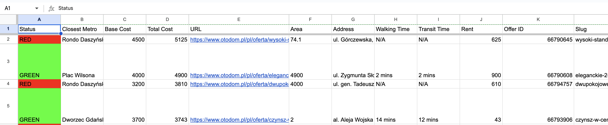

# Find me nest

This repo contains automation for fetching and parsing useful info from offers and saving them to google spreadsheet



## Requirements
- uv (for dependencies and running scripts)
- service account from google console: credentials in the form of service_account.json (to operate on provided google spreadsheet)
- google spreadsheet id
- open ai api key (to extract useful info from description)
- google maps api key (to calculate time from closest metro station by walking and comute)

## Usage

Create service account in [console.cloud.google](https://console.cloud.google.com/) and obatin `service_account.json`

Enable `Google Sheets API` and `Distance Matrix API`

Optain API key for google maps

Create spreadsheet and share it with service account(ex <account_name>.@<project_name>.iam.gserviceaccount.com)

```sh
uv run python3 fetch_offers.py
sh process_offers.sh current_offers.csv
```